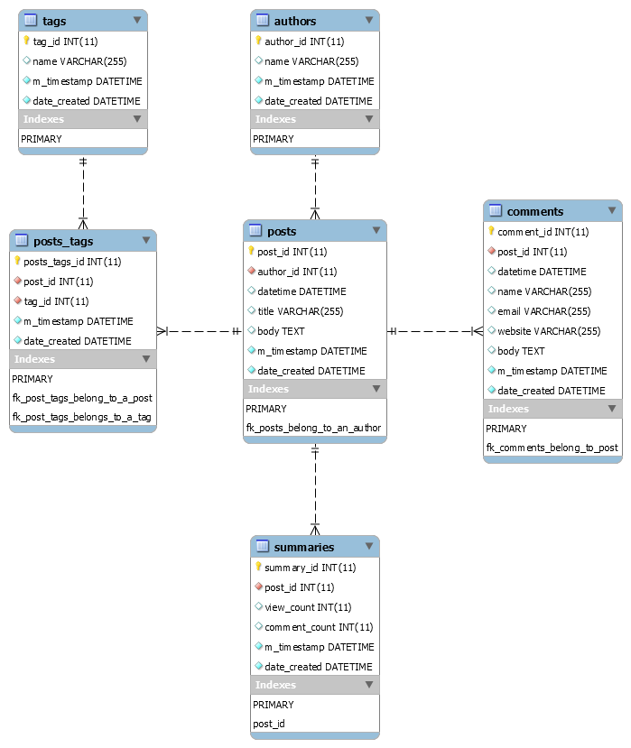

# PHP ORM Benchmarks

This repository is designed to benchmark the performance of various PHP ORM packages.

Below are the ORMs intended to be benchmarked:

- https://github.com/atlasphp/Atlas.Orm a.ka. Atlas [ALREADY SETUP]
- https://github.com/cakephp/orm a.ka. CakePHP ORM [NOT YET SETUP]
- https://github.com/cycle/orm a.ka. Cycle ORM [NOT YET SETUP]
- https://github.com/doctrine/orm/ a.ka. Doctrine ORM [NOT YET SETUP]
- https://github.com/illuminate/database a.ka. Eloquent [ALREADY SETUP]
- https://github.com/rotexsoft/leanorm a.ka. LeanORM [ALREADY SETUP]
- https://github.com/gabordemooij/redbean/blob/master/README.markdown a.ka. Redbean [NOT YET SETUP]

> Only ORM packages that are actively being maintained / have been 
updated in at least the last two years will be benchmarked. Orms that are not
actively being maintained will not be considered for benchmarking.

> This repo is initially designed to work with versions of the ORM packages
above that are compatible with PHP 7.4. Moving forward, there will be branches 
in this repo corresponding to default PHP versions in Ubuntu LTS releases, e.g. 
a branch named **php-74** (which shipped with Ubuntu 20.04 LTS), another branch
named **php-81** (which shipped with Ubuntu 22.04 LTS) etc. 

> Once the php branches are setup, the master branch will always contain code 
designed to run with the PHP version that ships with the latest ubntu LTS version 
at any particular moment. This will allow for being able to run benchmarks for the 
latest version of each ORM compatible with the PHP version the checked out branch 
corresponds with.

# Installation

- Clone this repository

- CD into the directory you cloned it to

- Install composer dependencies
>composer install

- Run migrations to setup the db (it will default to sqlite if you haven't modified **phinx.php**)
>./vendor/bin/phinx --verbose migrate

> The migrations take about 1 to 2 minutes to run.

Run the benchmarks

> ./run-eager-benchmarks.sh <path_to_folder_where_results_will_be_saved>

> ./run-eager-first-n-benchmarks.sh <path_to_folder_where_results_will_be_saved>

> ./run-no-eager-benchmarks.sh <path_to_folder_where_results_will_be_saved>

> ./run-no-eager-first-n-benchmarks.sh <path_to_folder_where_results_will_be_saved>

**<path_to_folder_where_results_will_be_saved>** should be replaced with the actual path where you want the test results to be saved.

## Test Methodology

Benchmarking is done using the schema below:

This project only considers 4 types of ORM database relationships
1. **Has one:** a type of relationship where an entity A (e.g. a post), has at least zero or at most one of another entity B (e.g. a summary)
2. **Belongs to:** a type of relationship where each record representing an entity A (e.g. a summary), belongs to another entity B (e.g. a post)
    - Entity A in this type of relationship cannot exist without the Entity B it belongs to (e.g. you cannot have a summary without a post).
3. **Has Many:** a type of relationship where an entity A (e.g. an author),  has at least zero or many of another entity B (e.g. a post). 
    - Entity B in this type of relationship cannot exist without entity A. You cannot have posts without an author.
4. **Has Many Through:** this type of relationship is also known as **Many to Many**. It is a type of relationship involving three database tables. An entity A (e.g. a post), has zero or many of another entity B (e.g. Tags) through another entity C (e.g. posts_tags). The database table containing data for the entity C is also sometimes referred to as a **pivot** table

- An author has many posts
- A post belongs to an author

- A post has many comments
- A comment belongs to a post

- A post has many posts_tags
- A post_tag belongs to a post

- A post has one summary
- A summary belongs to a post

- A post has many tags through posts_tags
- A tag has many posts through posts_tags

- A tag has many posts_tags
- A post_tag belongs to a tag

The tables are populated with the following amount of records when the migrations are successfully executed:

- authors will have 10,000 records
- comments will have 59,700 records
- posts will have 49,950 records
- posts_tags will have 249,500 records
- summaries will have 49,950 records
- tags will have 10,000 records

Each ORM being tested has been setup with the appropriate Model class files it 
needs to run and all the table relationships described above have been configured 
for each ORM.

The following scenarios will be run for each ORM:

1. Fetch all the records from each of the tables in the schema above 
(without eager-loading any related data). No related data will be 
accessed in this scenario.

    a. Fetch all records at once (without using limit to fetch chunks of record at a time)

    b. Fetch records in chunks with limit values of 10, 50, 100, 250, 500 & 1000 
    > NOTE: Some ORMs like Eloquent & LeanORM may have multiple methods for loading this data. Each method will be used to load the data and labeled in the benchmark results.

2. Fetch all the records from each of the tables in the schema above 
and also eager-load related data.

    a. Fetch all records at once (without using limit to fetch chunks of record at a time)
    
    b. Fetch records in chunks with limit values of 10, 50, 100, 250, 500 & 1000 
    > NOTE: Some ORMs like Eloquent & LeanORM may have multiple methods for loading this data. Each method will be used to load the data and labeled in the benchmark results.

SQLite defines a maximum of 999 parameters to be passed as arguments to a 
statement, controlled by SQLITE_MAX_VARIABLE_NUMBER. Because of this, when
eager loading related data for a fetch (which would lead to queries like
where foreign_key IN (?,?, .... , ?, ?) being passed to PDO under the hood),
the query must not have more than 999 ? placeholders, implying that we have 
to limit the chunk of recordsets to retrieve in each iteration to <= 999. 
Which also means we can't fetch all the records from a table with more than
999 records at once, we have to specify a limit value to fetch the records
in chunks. Mysql does not have this limitation & I am guessing postgres & sqlsvr do not
have this limitation.

## Test Results
You can run the benchmark script yourself on your own machine in your own environment. They take time though. The tests to fetch data from all the tables with various limit values and no limit value takes about 4 hours to run. Below is a link to benchmarks that have already been run:

* [Benchmark Results](https://rotexsoft.github.io/benchmarkorms)

## Disclaimer

I am the author of [LeanORM](https://github.com/rotexsoft/leanorm). This project 
was birthed out of a personal desire to compare the performance of LeanORM to 
other popular ORMs in performing the common data fetching scenarios described above. 

I have been able to identify some bottle-necks in LeanORM and was able to update 
it to improve its performance. I hope other ORM maintainers would find this project 
useful and also be able to update their packages to be more performant in areas they 
lag behind other ORM packages. For users of the various ORM packages, this tool should 
hopefully be able to help you evaluate the strength and weaknesses of your chosen ORM 
packages and would allow you to write your application in a way that leverages the 
strengths of your chosen ORM. Cheers!